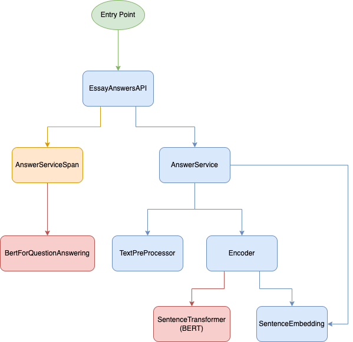

# essay_answers

## Project Summary

In this project we will be creating an application that receives an essay and some queries from the user and returns the answers to these queries. This service will be available to the user through API endpoints.

## Project Design and Technical Decisions

### Class Architecture

The project follows a modular architecture with clearly defined class structures. Below is a simplified diagram illustrating how different components interact:

<div align="center">
	
</div>

- **SentenceEmbedding**: This class represents a sentence and its corresponding embedding, providing methods for calculating cosine similarity and finding the most similar sentence.
- **SentenceTransformer (BERT)**: This class (imported from external library) enables the use of the BERT model `all-mpnet-base-v2`
- **Encoder**: This class is responsible for encoding essay sentences and queries into embeddings using the BERT model described before.
- **TestPreProcessor**: This class preprocesses the essay by splitting it into paragraphs and sentences, identifying subtitles, and organizing text for further analysis.
- **AnswerService**: The service class that handles the core logic of finding answers to the queries by comparing query embeddings with essay embeddings and subtitles.
- **EssayAnswersAPI**: This class encapsulates the API logic and provides the `/answers` endpoint (and others) for receiving essay and query input, coordinating the validation and answer generation process.

- **AnswerServiceSpan and BertForQuestionAnswering**: These classes will be described in the section [*Extra: Reimplementation using a new model*](#extra-reimplementation-using-a-new-model)


### Model Used for Creating Embeddings

The all-mpnet-base-v2 model from the SentenceTransformer library was chosen for generating embeddings due to its high performance in tasks like sentence similarity and question answering. This BERT-based model captures complex word relationships, producing compact embeddings that enable efficient and accurate query matching. The SentenceTransformer library's ease of use and the pre-trained model's efficiency make it ideal for this task.

### Similarity Measure Used for Comparing Embeddings

Cosine similarity was chosen due to its focus on the angle between vectors rather than their magnitude, optimizing for semantic similarity of the embeddings. In addition to that widespread use of BERT and cosige similarity alongside each other makes the cosige similarity the ideal measurement of similarity.

### Approaches to Dividing Essay Into Sentences:

First we chose to not consider the titles/subtitles of the essay as possible answers to the query. This avoids the case where the answer to a query is a subtitle that has words that are in the query (which make it very similar to the query) but don't provide any concrete information for answering the question.

From that we created two approaches on how to divide the essay into sentences, each with their pros and cons:

#### 1. Analyzing all the sentences that are not subtitles

This first solution consists in embedding all the sentences (that are not subtitles) and then searching for the sentence embedding most similar to the query.

- **Pro:** this approach is thorough and ensures that the sentence returned as the answer is the most similar possible for a given query
- **Con:** this approach has a higher computational complexity due to having to embed and compare all non-subtitle sentences

**Important:** to use this approach you must use the endpoint `/answers` that is described in the [API Reference](#api-reference) section

#### 2. Analyzing only the sentences under the most similar subtitle

This second solution consists in:
1) Embedding only the subtitles of the essay
2) Searching for the subtitle that is most similar to the query
3) Then Embedding only the sentences that are under the most similar subtitle found in the last step
4) Finally searching for the sentence under the subtitle found in step 2) that is most similar to the query

- **Pro:** this approach has a lower computational complexity due to not having to embed and search through all the sentences of the essay. In this approach you would only search through the subtitles and then through the sentences under the subtitle that is most similar to the query.
- **Con:** this approach can lead to suboptimal answers, because there is no guarantee that the sentence that best answers query will be under the the subtitle that is most similar to the query.

**Important:** to use this approach you must use the endpoint `/answers_based_on_subtitles` that is described in the [API Reference](#api-reference) section

### Formatting and Style Guide

- The code adheres to the [PEP8](https://pep8.org/) guidelines for Python
- A maximum line length of **90 characters** was chosen for improved readability in modern editor environments (especially due to the fact that typing was used).
- Comments follow a **72-character** limit per line to ensure clarity in explanations without overly long lines.
- Classes, functions, and variables follow a clear and consistent naming convention that aims for readability and clarity.

### Error Handling

We use structured error handling, ensuring that all API endpoints return meaningful error messages when invalid input is received.

- **400 Bad Request**: This status is returned when the client sends malformed or invalid data, such as missing required fields, an empty essay, or improperly formatted queries..
- **500 Internal Server Error**: This status is returned for any unexpected issues that occur within the server or application logic, indicating that something went wrong on the server-side.

### Dependencies Management

- Dependencies are managed using `pipenv` for environment isolation and reproducibility.
- Docker is used for consistent environment management.

### Logging

The project implements logging in various components to provide detailed insights into the internal operations. Logging is used to track the following processes:

- Text preprocessing (splitting paragraphs, identifying subtitles, etc...).
- Sentence encoding and embedding generation.
- Query and essay comparison to find the most relevant answers.
- Validation and API requests handling in EssayAnswersAPI.

## Prerequisites

### Docker

Ensure you have Docker installed on your machine. Docker will handle the environment setup, including system dependencies and Python package installations.

### Dependencies

This project uses the following Python packages, which are automatically installed within the Docker container:

- `flask`
- `gunicorn`
- `pybind11`
- `sentence-transformers`
- `numpy==1.24`
- `mypy`
- `pytest`
- `flask-testing`
- `torch`
- `requests`
- `ipykernel`

The dependencies are managed using `pipenv`. You do not need to install these manually unless running the application outside of Docker.

## Installation

### Step 1: Clone the repository

```bash
git clone https://github.com/ddgob/essay_answers
cd essay_answers
```

### Step 2: Build the Docker container

Build and run the application using Docker:

```bash
docker build -t essay_answers .
docker run -d -p 8000:8000 --name essay_answers_api essay_answers
```

This command will:

- Build the Docker image using the Dockerfile file.
- Install system dependencies (e.g., cmake, g++, etc.).
- Install Python dependencies using pipenv.
- Build necessary pybind11 module.
- Set up the container environment and expose port 8000.

### Step 3: Verify the container is running

You can verify that the container is running and the API is listening on http://0.0.0.0:8000.

```bash
docker ps
```

You should see the running container named something like essay_answers_api

## Usage

Once the container is up and running, you can start interacting with the API.

### Start Here

The best way to see and understand the usage of the API and it's features is to follow this [quick tutorial](./quick_tutorial.ipynb).

### Another (worse) Option

However, if you don't want to fully understand how the API works and not see it's features, here’s an example of how to send a POST request to the `/answers` endpoint.

#### Example Request:

```bash
curl -X POST http://127.0.0.1:8000/answers \
    -H "Content-Type: application/json" \
    -d '{
            "essay": "Introduction to Trees.\nTrees are green. Trees have leaves. Trees are tall.\nConclusion\nI love trees. I want to buy five trees.", 
            "queries": ["What is the color of trees?", "How tall are trees?", "How many trees do I want to buy?"]
        }'
```

**Important:** make sure you have `curl` installed

#### Example Response:

```bash
{
  "answers": ["Trees are green", "Trees are tall", "I want to buy five trees"]
}
```

**Note:** the same can be done to use the `/answers_based_on_subtitles` endpoint. Just change the address of the POST request!

## API Reference

- POST `/answers`
    - **Description:** Returns the answers to the provided queries based on the given essay.
    - **Request Body:**
        - `essay` (string): The essay text.
        - `queries` (array of strings): A list of queries related to the essay.
    - **Request Body:**
        - `answers` (array of strings): A list of answers corresponding to the queries.

- POST `/answers_based_on_subtitles`
    - **Description:** Returns the answers to the provided queries by first finding the subtitles that best match them, and then finding the sentences inside the paragraphs corresponding to those subtitles that best match the queries.
    - **Request Body:**
        - `essay` (string): The essay text.
        - `queries` (array of strings): A list of queries related to the essay.
    - **Request Body:**
        - `answers` (array of strings): A list of answers corresponding to the queries.
  
- POST `/answers_span`
    - Refer to [API Endpoint: `/answers_span`](#api-endpoint-answers_span)


## Testing

To test the application, you can run the following command:

```bash
docker exec -it essay_answers_api python tests/run_checks.py
```

This will run pytest on all the tests implemented in `/tests` and also check the typing in the whole project using `mypy`.

## *Extra: Reimplementation using a new model*

In addition to sentence embedding based answering, this project includes span-based question answering using a question answering specific BERT model.

### Span-based Question Answering: `AnswerServiceSpan`

The `AnswerServiceSpan` class leverages the `bert-large-uncased-whole-word-masking-finetuned-squad` model to extract the exact answer from an essay by identifying the start and end positions of the answer span.

#### How It Works:
- **BERT Model**: The pre-trained BERT model identifies answer spans within an essay.
- **Method**: The model receives both the essay and query, returning the text span that best answers the query.
- **Use Case**: Ideal for precise extraction of information.

### API Endpoint: `/answers_span`

You can use this endpoint to submit essays and queries, receiving specific text spans as answers.

#### Example Request:

```bash
curl -X POST http://127.0.0.1:8000/answers_span \
    -H "Content-Type: application/json" \
    -d '{
            "essay": "The quick brown fox jumps over the lazy dog.",
            "queries": ["What does the quick brown fox jump over?"]
        }'
```

#### Example Response:

```json
{
  "answers": ["the lazy dog"]
}
```
